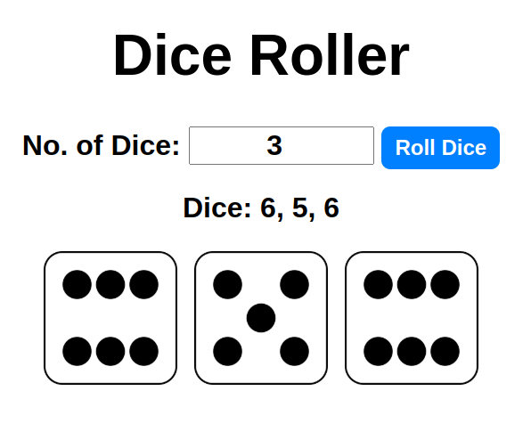

# Dice Roller App

A dynamic, interactive Dice Roller built with **vanilla JavaScript**.  
You can roll as many dice as you want, and each result is visualized with crisp dice images — just like the real thing

---

## Screenshot

Here’s a preview of the Dice Roller in action:



---

## Demo Preview

> ✅ Input the number of dice  
> ✅ Click "Roll Dice"  
> ✅ See randomized results + matching images  
> ✅ Fully dynamic and interactive

---

## Live Demo

- [Live Site]( https://michael-okorie.github.io/Dice-Roller/)  
- [GitHub Repo](https://github.com/Michael-Okorie/Dice-Roller.git)

---

## Built With

- **HTML5** – clean semantic structure  
- **CSS3** – minimal styling (or go styled how you like)  
- **JavaScript (ES6)** – full control of the DOM, loops, randomness  
- **No frameworks** – raw code, real logic, no shortcuts

---

## Features

- Roll 1 or multiple dice at once  
- Dynamically display images based on the roll  
- Instant results, no page reloads  
- Logic written from scratch (no libraries or dependencies)

---

## What I Learned

This project helped me practice and solidify:
- DOM element targeting (`getElementById`)
- Dynamic loops and value generation
- Random number logic in JavaScript
- `innerHTML` vs `textContent`
- Using template literals for clean image insertion

---

## Code Highlight

```js
const value = Math.floor(Math.random() * 6) + 1;
images.push(``);
```

## Author

- GitHub – [@Michael-Okorie](https://github.com/Michael-Okorie)
- Frontend Mentor – [@Michael-Okorie](https://www.frontendmentor.io/profile/Michael-Okorie)
- Twitter – [@Dev_Michael_](https://x.com/Dev_Michael_)

---

## Acknowledgments

Big shoutout to the JavaScript dev community and creators who post their code journeys online — your inspiration helps fuel learning every day 💯
